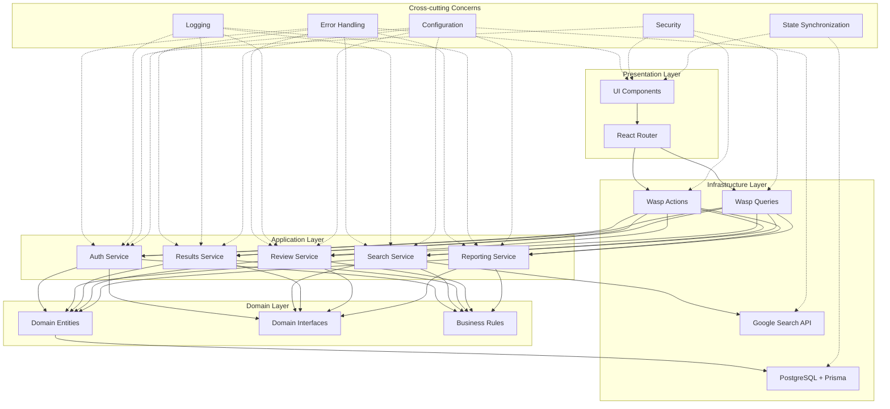

# Thesis Grey Architecture Documentation

## Architecture Overview
Thesis Grey follows a Vertical Slice Architecture (VSA) with CQRS influences, organizing code around features rather than technical layers. This approach provides better cohesion and simpler testing while aligning with the requirements specified in the PRD.


<details>
<summary>Diagram Source</summary>


</details>

## Core Layers

### Domain Layer
The Domain Layer contains the core business entities, interfaces, and business rules that define the application's domain model.

#### Entities
- **User**: Represents a user of the system with authentication credentials
- **SearchSession**: Represents a search session containing multiple search queries
- **SearchQuery**: Represents a specific search query within a session
- **SearchExecution**: Represents the execution of a search query
- **RawSearchResult**: Represents a raw search result from an external search engine
- **ProcessedResult**: Represents a processed search result with normalized data
- **ReviewTag**: Represents a tag that can be applied to search results
- **ReviewTagAssignment**: Represents the assignment of a tag to a search result
- **Note**: Represents a note attached to a search result
- **DuplicateRelationship**: Represents a relationship between duplicate search results

#### Interfaces
- **SearchProvider**: Defines the contract for search providers
  ```typescript
  interface SearchProvider {
    executeSearch(query: string, options: SearchOptions): Promise<RawSearchResult[]>;
  }
  ```
- **ResultProcessor**: Defines the contract for processing search results
  ```typescript
  interface ResultProcessor {
    processResult(rawResult: RawSearchResult): Promise<ProcessedResult>;
    detectDuplicates(results: ProcessedResult[]): Promise<DuplicateRelationship[]>;
  }
  ```
- **ReviewManager**: Defines the contract for managing the review process
  ```typescript
  interface ReviewManager {
    createTag(name: string, color: string, sessionId: string): Promise<ReviewTag>;
    assignTag(tagId: string, resultId: string): Promise<ReviewTagAssignment>;
    createNote(content: string, resultId: string): Promise<Note>;
  }
  ```
- **ReportGenerator**: Defines the contract for generating reports
  ```typescript
  interface ReportGenerator {
    generatePrismaFlow(sessionId: string): Promise<PrismaFlowData>;
    generateStatistics(sessionId: string): Promise<SessionStatistics>;
    exportResults(sessionId: string, format: 'csv' | 'json'): Promise<string>;
  }
  ```

#### Business Rules
- Authentication requirements: Users must be authenticated to access the system
- PRISMA workflow compliance: The review process must follow the PRISMA workflow
- Search result processing rules: Results must be normalized and deduplicated

### Application Layer
The Application Layer implements the use cases of the application, orchestrating the flow of data to and from the domain entities.

#### Use Cases

*   **User Authentication**: Registration on the `Signup Page`, login on the `Login Page`, and profile management on the `User Profile Page`. Upon successful authentication, users are directed to the `Review Manager Dashboard`.
*   **Review Management**: The `Review Manager Dashboard` serves as the central landing page after authentication, displaying all review sessions owned by the user, categorized by status (Draft, In Progress, Completed). Users can create new reviews, access existing reviews based on their status, and manage their review portfolio.
*   **Search Session & Strategy Management**: Creating and managing `SearchSession` entities and their associated `SearchQuery` entities on the `Search Strategy Page`. This page is accessed from the Review Manager Dashboard when creating a new review or accessing a draft review.
*   **Search Execution & Monitoring**: Executing search queries (defined in a `SearchSession`) against external search engines and managing/displaying real-time progress on the `Search Execution Status Page`. This page is accessed from the Review Manager Dashboard for reviews in the executing state.
*   **Results Processing & Management**: Background processing (normalization, metadata extraction, basic deduplication) of `RawSearchResult` entities into `ProcessedResult` entities. In Phase 2, this includes providing specialized interfaces for Lead Reviewers, such as the `Deduplication Overview Page` and `Processing Status Dashboard`, for finer-grained control and monitoring.
*   **Results Review**: Displaying processed results on the `Results Overview Page`, accessed from the Review Manager Dashboard for completed reviews, and facilitating tagging, annotating, and detailed review of individual items on the `Review Interface Page`.
*   **Reporting**: Generating reports (including PRISMA flow data and statistics) and exporting data via the `Reporting Page`.
*   **Session Lifecycle & Navigation (Phase 2)**: The `Session Hub Page` acts as a central navigation point for a selected Phase 2 review session, offering role-dependent views and actions for Lead Reviewers and Reviewers, linking to various feature pages like `Search Strategy Page`, `Results Overview Page`, `Reporting Page`, etc., all within the context of that session.

#### Services

*   **ReviewManagerService**: Manages the central Review Manager Dashboard, handling the display and organization of all review sessions, their status updates, and navigation to appropriate feature pages based on review status.
*   **AuthService**: Handles user authentication (login/signup) and authorization, interacting with the `User` entity and directing authenticated users to the Review Manager Dashboard.
*   **SearchStrategyService**: Manages `SearchSession` and `SearchQuery` entities. Supports operations for the `Search Strategy Page`, including creating/listing sessions and defining search parameters. It also plays a role in providing data for and managing the state related to initiating searches that transition to the `Search Execution Status Page`.
*   **SerpExecutionService**: Responsible for executing `SearchQuery` entities against external APIs (e.g., Serper) and tracking their progress. It updates `SearchExecution` and `RawSearchResult` entities and provides status updates for the `Search Execution Status Page`.
*   **ResultsManagerService**: Handles the backend processing of `RawSearchResult` into `ProcessedResult` entities, including normalization, metadata extraction, and deduplication. It provides status updates for the consolidated Phase 2 `Search Execution Status Page`. In Phase 2, it also exposes data and functionalities for specialized Lead Reviewer interfaces like the `Deduplication Overview Page` and `Processing Status Dashboard`.
*   **ReviewService**: Manages core aspects of the review process, such as tagging (`ReviewTag`, `ReviewTagAssignment`) and notes (`Note`) for `ProcessedResult` entities. This service supports both the `Results Overview Page` (for displaying tag status) and the `Review Interface Page` (for detailed review actions).
*   **SessionHubService (Phase 2)**: Orchestrates the `Session Hub Page`, providing role-specific data and handling actions for this session-specific dashboard. It integrates with other services to provide a unified view of a Phase 2 session.
*   **ReportingService**: Generates reports and exports data for a given `SearchSession`, supporting the `Reporting Page`.

#### State Management
- Server-side state with client-side caching using React Query (provided by Wasp)
- Optimistic UI updates for a responsive user experience

### Infrastructure Layer
The Infrastructure Layer provides technical capabilities to support the application.

#### External Services
- **Google Search API via Serper**: Provides search results from Google

#### Persistence
- **PostgreSQL**: Relational database for storing application data
- **Prisma ORM**: Object-Relational Mapping for database access

#### Communication
- **RESTful API endpoints**: Wasp actions and queries for client-server communication

### Presentation Layer
The Presentation Layer handles the user interface and user interactions.

#### UI Components

*   React components organized by feature (auth, searchStrategy, serpExecution, etc.). Key top-level page components include:
    *   `LoginPage` (`/login`)
    *   `SignupPage` (`/signup`)
    *   `UserProfilePage` (`/profile`)
    *   `SearchStrategyPage` (`/search-strategy`)
    *   `SearchExecutionStatusPage` (`/search-execution/:sessionId`)
    *   `ResultsOverviewPage` (`/results-overview/:sessionId`)
    *   `ReviewInterfacePage` (`/review/:resultId`)
    *   `ReportingPage` (`/reporting/:sessionId`)
    *   (Phase 2) `SessionHubPage` (`/session-hub/:sessionId` - TBC)
    *   (Phase 2) `DeduplicationOverviewPage`
    *   (Phase 2) `ProcessingStatusDashboardPage`
*   Reusable UI components are located in the `src/client/shared/components/` directory.

#### Routing

*   React Router (provided by Wasp) for client-side routing, directing users to feature-specific pages such as `SearchStrategyPage`, `SearchExecutionStatusPage`, `ResultsOverviewPage`, `ReviewInterfacePage`, and the Phase 2 `SessionHubPage`, based on application state and user actions.

#### Styling
- TailwindCSS for utility-first styling

## Cross-cutting Concerns

### Error Handling
- **Centralized Error Handling**: Custom error types and consistent error responses
- **Error Boundaries**: React error boundaries to prevent UI crashes
- **Error Logging**: Structured error logging for debugging

### Logging
- **Structured Logging**: JSON-formatted logs with severity levels
- **Contextual Information**: Request IDs, user IDs, and other contextual information
- **Log Levels**: DEBUG, INFO, WARN, ERROR, and FATAL

### Security
- **JWT-based Authentication**: Secure authentication using JSON Web Tokens. This foundation is used to implement Role-Based Access Control (RBAC), determining user capabilities on pages like the `Session Hub Page` and for actions such as search re-execution or accessing administrative views of results processing.
- **Input Validation**: Validation of all user inputs to prevent injection attacks
- **CSRF Protection**: Protection against Cross-Site Request Forgery attacks

### State Synchronization
- **Optimistic UI Updates**: Update the UI immediately, then validate with the server
- **Conflict Resolution**: Resolve conflicts between client and server state
- **Loading States**: Clear indication of loading states for better user experience

### Configuration
- **Environment-based Configuration**: Different configurations for development, testing, and production
- **Sensible Defaults**: Default configuration values for all settings
- **Secret Management**: Secure management of sensitive configuration values

## Integration Patterns

### External Service Integration
- **Adapter Pattern**: Adapters for external services to provide a consistent interface
- **Resilience**: Retry mechanisms and circuit breakers for external service calls
- **Caching**: Caching of external service responses to reduce API calls

### Inter-service Communication
- **Direct Method Calls**: Direct method calls within the monolith for efficiency
- **Service Interfaces**: Well-defined interfaces between services for loose coupling

### Event Handling
- **Simple Pub/Sub**: A simple publish-subscribe mechanism for internal events
- **Event Types**: Well-defined event types for type safety

### State Persistence
- **Repository Pattern**: Repositories for data access abstraction
- **Unit of Work**: Transactions for maintaining data consistency

## Component Interactions
The application follows a unidirectional data flow:

1.  User Interaction: The user interacts with UI components on a specific page (e.g., `Search Strategy Page`).
2.  Route Handling: React Router ensures the correct page component is active.
3.  Action/Query Dispatch: The page component dispatches a Wasp action or query.
4.  Service Orchestration: The relevant service (e.g., `SearchStrategyService`, `SerpExecutionService`) orchestrates the use case, calling domain entities and interfaces.
5.  Data Access: Repositories access the database via Prisma ORM.
6.  Response Flow: The response flows back through the layers to the UI, updating the page (e.g., `Search Execution Status Page` showing progress, or `Results Overview Page` displaying results).

This flow applies to all interactions, including navigation to and actions within all standard workflow pages.

## Interface Contracts
The application defines clear interface contracts between components:

### SearchProvider Interface
```typescript
interface SearchProvider {
  executeSearch(query: string, options: SearchOptions): Promise<RawSearchResult[]>;
}
```

### ResultProcessor Interface
```typescript
interface ResultProcessor {
  processResult(rawResult: RawSearchResult): Promise<ProcessedResult>;
  detectDuplicates(results: ProcessedResult[]): Promise<DuplicateRelationship[]>;
}
```

### ReviewManager Interface
```typescript
interface ReviewManager {
  createTag(name: string, color: string, sessionId: string): Promise<ReviewTag>;
  assignTag(tagId: string, resultId: string): Promise<ReviewTagAssignment>;
  createNote(content: string, resultId: string): Promise<Note>;
}
```

### ReportGenerator Interface
```typescript
interface ReportGenerator {
  generatePrismaFlow(sessionId: string): Promise<PrismaFlowData>;
  generateStatistics(sessionId: string): Promise<SessionStatistics>;
  exportResults(sessionId: string, format: 'csv' | 'json'): Promise<string>;
}
```
