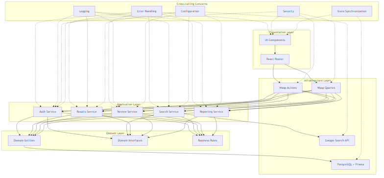
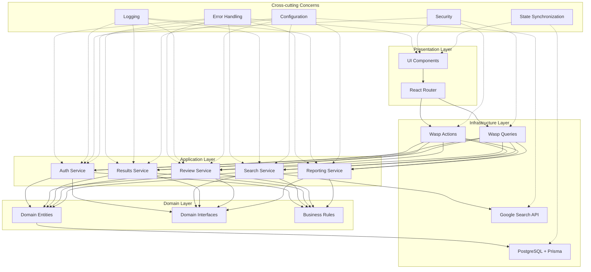

# Thesis Grey Architecture Documentation

## Architecture Overview
Thesis Grey follows a Vertical Slice Architecture (VSA) with CQRS influences, organizing code around features rather than technical layers. This approach provides better cohesion and simpler testing while aligning with the requirements specified in the PRD.



<details>
<summary>Diagram Source</summary>


</details>

## Core Layers

### Domain Layer
The Domain Layer contains the core business entities, interfaces, and business rules that define the application's domain model.

#### Entities
- **User**: Represents a user of the system with authentication credentials
- **SearchSession**: Represents a search session containing multiple search queries
- **SearchQuery**: Represents a specific search query within a session
- **SearchExecution**: Represents the execution of a search query
- **RawSearchResult**: Represents a raw search result from an external search engine
- **ProcessedResult**: Represents a processed search result with normalized data
- **ReviewTag**: Represents a tag that can be applied to search results
- **ReviewTagAssignment**: Represents the assignment of a tag to a search result
- **Note**: Represents a note attached to a search result
- **DuplicateRelationship**: Represents a relationship between duplicate search results

#### Interfaces
- **SearchProvider**: Defines the contract for search providers
  ```typescript
  interface SearchProvider {
    executeSearch(query: string, options: SearchOptions): Promise<RawSearchResult[]>;
  }
  ```
- **ResultProcessor**: Defines the contract for processing search results
  ```typescript
  interface ResultProcessor {
    processResult(rawResult: RawSearchResult): Promise<ProcessedResult>;
    detectDuplicates(results: ProcessedResult[]): Promise<DuplicateRelationship[]>;
  }
  ```
- **ReviewManager**: Defines the contract for managing the review process
  ```typescript
  interface ReviewManager {
    createTag(name: string, color: string, sessionId: string): Promise<ReviewTag>;
    assignTag(tagId: string, resultId: string): Promise<ReviewTagAssignment>;
    createNote(content: string, resultId: string): Promise<Note>;
  }
  ```
- **ReportGenerator**: Defines the contract for generating reports
  ```typescript
  interface ReportGenerator {
    generatePrismaFlow(sessionId: string): Promise<PrismaFlowData>;
    generateStatistics(sessionId: string): Promise<SessionStatistics>;
    exportResults(sessionId: string, format: 'csv' | 'json'): Promise<string>;
  }
  ```

#### Business Rules
- Authentication requirements: Users must be authenticated to access the system
- PRISMA workflow compliance: The review process must follow the PRISMA workflow
- Search result processing rules: Results must be normalized and deduplicated

### Application Layer
The Application Layer implements the use cases of the application, orchestrating the flow of data to and from the domain entities.

#### Use Cases
- **User Authentication**: Registration, login, and profile management
- **Search Strategy Building**: Creating and managing search sessions and queries
- **Search Execution**: Executing search queries against external search engines, including managing and displaying the real-time progress on the `Search Execution Status Page`. In Phase 2, this page provides a consolidated view of both SERP query execution and subsequent results processing.
- **Results Management**: Processing, normalizing, and deduplicating search results. In Phase 2, this includes providing specialized interfaces for Lead Reviewers, such as the 'Deduplication Overview' and 'Processing Status Dashboard', for finer-grained control and monitoring.
- **Review Process**: Tagging, annotating, and reviewing search results
- **Reporting**: Generating reports and exporting data
- **Review Session Lifecycle & Navigation**: Managing the overall review session lifecycle and user navigation. This includes directing users to the appropriate stage of their review (e.g., `Search Strategy Builder`, `Search Execution Status Page`, `Results Overview Page`). In Phase 2, this is further enhanced by the `Session Hub Page`, which acts as a central navigation point for a selected review session, offering role-dependent views and actions for both Lead Reviewers and Reviewers.

#### Services
- **AuthService**: Handles user authentication and authorization
- **SearchService**: Manages search sessions and queries. It also plays a role in providing data for and managing the state related to the `Search Execution Status Page`.
- **ResultsService**: Processes and manages search results. In Phase 2, it exposes data and functionalities for specialized Lead Reviewer interfaces like the 'Deduplication Overview' and 'Processing Status Dashboard'.
- **ReviewService**: 
  - **Phase 1 & 2:** Manages core aspects of the review process for individual sessions, such as tagging and notes. Crucially, it is responsible for operations that support the `Review Manager Dashboard`, such as fetching the list of all review sessions associated with a user.
  - **Phase 2:** Its role expands to include orchestrating the `Session Hub Page` (providing data and handling actions for this session-specific dashboard) and managing more complex role-based access and collaborative features within a review session.
- **ReportingService**: Generates reports and exports data

#### State Management
- Server-side state with client-side caching using React Query (provided by Wasp)
- Optimistic UI updates for a responsive user experience

### Infrastructure Layer
The Infrastructure Layer provides technical capabilities to support the application.

#### External Services
- **Google Search API via Serper**: Provides search results from Google

#### Persistence
- **PostgreSQL**: Relational database for storing application data
- **Prisma ORM**: Object-Relational Mapping for database access

#### Communication
- **RESTful API endpoints**: Wasp actions and queries for client-server communication

### Presentation Layer
The Presentation Layer handles the user interface and user interactions.

#### UI Components
- React components organized by feature (auth, searchStrategy, serpExecution, etc.). Key top-level page components include the `Review Manager Dashboard`, `Search Strategy Builder`, `Search Execution Status Page` (with Phase 1 and enhanced Phase 2 versions), `Results Overview Page`, and in Phase 2, the `Session Hub Page`. Reusable UI components in the shared directory

#### Routing
- React Router (provided by Wasp) for client-side routing, directing users to feature-specific pages like the `Search Strategy Builder`, `Search Execution Status Page`, `Results Overview Page`, and the Phase 2 `Session Hub Page`, based on application state and user actions.

#### Styling
- TailwindCSS for utility-first styling

## Cross-cutting Concerns

### Error Handling
- **Centralized Error Handling**: Custom error types and consistent error responses
- **Error Boundaries**: React error boundaries to prevent UI crashes
- **Error Logging**: Structured error logging for debugging

### Logging
- **Structured Logging**: JSON-formatted logs with severity levels
- **Contextual Information**: Request IDs, user IDs, and other contextual information
- **Log Levels**: DEBUG, INFO, WARN, ERROR, and FATAL

### Security
- **JWT-based Authentication**: Secure authentication using JSON Web Tokens. This foundation is used to implement Role-Based Access Control (RBAC), determining user capabilities on pages like the `Session Hub Page` and for actions such as search re-execution or accessing administrative views of results processing.
- **Input Validation**: Validation of all user inputs to prevent injection attacks
- **CSRF Protection**: Protection against Cross-Site Request Forgery attacks

### State Synchronization
- **Optimistic UI Updates**: Update the UI immediately, then validate with the server
- **Conflict Resolution**: Resolve conflicts between client and server state
- **Loading States**: Clear indication of loading states for better user experience

### Configuration
- **Environment-based Configuration**: Different configurations for development, testing, and production
- **Sensible Defaults**: Default configuration values for all settings
- **Secret Management**: Secure management of sensitive configuration values

## Integration Patterns

### External Service Integration
- **Adapter Pattern**: Adapters for external services to provide a consistent interface
- **Resilience**: Retry mechanisms and circuit breakers for external service calls
- **Caching**: Caching of external service responses to reduce API calls

### Inter-service Communication
- **Direct Method Calls**: Direct method calls within the monolith for efficiency
- **Service Interfaces**: Well-defined interfaces between services for loose coupling

### Event Handling
- **Simple Pub/Sub**: A simple publish-subscribe mechanism for internal events
- **Event Types**: Well-defined event types for type safety

### State Persistence
- **Repository Pattern**: Repositories for data access abstraction
- **Unit of Work**: Transactions for maintaining data consistency

## Component Interactions
The application follows a unidirectional data flow:

1. **User Interaction**: The user interacts with the UI components
2. **Route Handling**: React Router routes the request to the appropriate page component
3. **Action/Query Dispatch**: The page component dispatches a Wasp action or query
4. **Service Orchestration**: The service orchestrates the use case, calling domain entities and interfaces
5. **Data Access**: The repositories access the database via Prisma ORM
6. **Response Flow**: The response flows back through the layers to the UI

This flow applies to all interactions, including navigation to and actions within new workflow pages such as the `Search Execution Status Page` and the `Session Hub Page`, where services provide the necessary data and handle operations initiated by user actions on these pages.

## Interface Contracts
The application defines clear interface contracts between components:

### SearchProvider Interface
```typescript
interface SearchProvider {
  executeSearch(query: string, options: SearchOptions): Promise<RawSearchResult[]>;
}
```

### ResultProcessor Interface
```typescript
interface ResultProcessor {
  processResult(rawResult: RawSearchResult): Promise<ProcessedResult>;
  detectDuplicates(results: ProcessedResult[]): Promise<DuplicateRelationship[]>;
}
```

### ReviewManager Interface
```typescript
interface ReviewManager {
  createTag(name: string, color: string, sessionId: string): Promise<ReviewTag>;
  assignTag(tagId: string, resultId: string): Promise<ReviewTagAssignment>;
  createNote(content: string, resultId: string): Promise<Note>;
}
```

### ReportGenerator Interface
```typescript
interface ReportGenerator {
  generatePrismaFlow(sessionId: string): Promise<PrismaFlowData>;
  generateStatistics(sessionId: string): Promise<SessionStatistics>;
  exportResults(sessionId: string, format: 'csv' | 'json'): Promise<string>;
}
```
